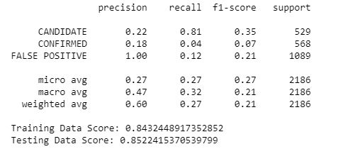
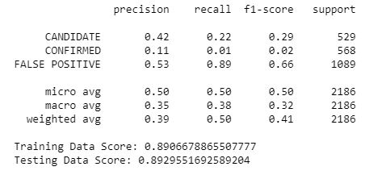
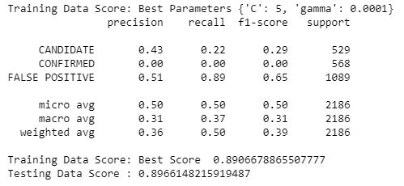

## Machine Learning
### Summary
This repository contains a code with three models that were developed to determine a False Positive, a candidate or an actual hidden planet outside our solar system.  
### Technical Details
In order to run the code, it is required Visual Studio or Jupyter Notebook. 
### Screenshots
MinMax.JPG 
  
SVC.JPG 
  
GridSearch.JPG 
  
### Explanations 
The outcome is shown in screenshots for reference purpose of the public. 

### Summary about findings 
Two models were developed to determine a False Positive, a candidate or an actual hidden planet outside our solar system. The first model was SVC linear scaled with the initial and last quartile (MinMax). In addition, a variant of the same model was built with a standard-lineal scaler providing the best result of the analysis at 89%. Finally, the GridSearchCV with parameters C:10 and gamma:0.001 slightly underfitted in comparison with the best score.  
Introduction  
The koi_disposition was the dependent variable and was calculated based on independent variables with numerical data. However, some columns included unique numerical data which was impossible to analyze. Therefore, the unnecessary variables were not considered such as “rowed”, “kepid”, “kepoi_name”, “kepler_name”, “koi_pdisposition”, “koi_score” and “koi_tce_delivname”.  
A comparison of each performance  
First, the model score for linear SVC was 85.36% in comparison with 84.62% provided by the testing data scaled through MinMax. Having almost the same score in testing and training, the model was considered to be in the ‘sweet spot’.   

MinMaxScaler() 
                precision    recall  f1-score   support

     CANDIDATE       0.15      0.01      0.02       529
     CONFIRMED       0.08      0.03      0.04       568
     FALSE POSITIVE  0.46      0.83      0.60      1089

     micro avg       0.42      0.42      0.42      2186
     macro avg       0.23      0.29      0.22      2186
     weighted avg    0.29      0.42      0.31      2186

Training Data Score: 0.8536139066788655 
Testing Data Score: 0.8462946020128088 

The same model scaled with StandardScaler showed a Training Data Score at 89.17% while its testing data derived an 88.92%. But for the small difference between both scores, the model would be under or over fitted.  

StandardScaler()
                precision    recall  f1-score   support

     CANDIDATE       0.29      0.02      0.04       529
     CONFIRMED       0.00      0.00      0.00       568
     FALSE POSITIVE  0.49      0.98      0.66      1089

     micro avg       0.49      0.49      0.49      2186
     macro avg       0.26      0.33      0.23      2186
     weighted avg    0.32      0.49      0.34      2186

Training Data Score: 0.8917352851479109 
Testing Data Score: 0.889295516925892 

Second, the ‘C’:10 and ‘gamma’:0.0001 GridSearchCV reached a model score just over 87% compared to its testing score at 86.96%. Hardly ever does not GrisSearchCV reach an optimal point but also it never misleads the sweet point far away from its best calculated parameters.  

GridSearchCV()
                precision    recall  f1-score   support

     CANDIDATE       0.27      0.05      0.08       529
     CONFIRMED       0.18      0.16      0.17       568
     FALSE POSITIVE  0.50      0.74      0.60      1089

     micro avg       0.42      0.42      0.42      2186
     macro avg       0.32      0.31      0.28      2186
     weighted avg    0.36      0.42      0.36      2186

Testing Data Score : 0.8696248856358646  
Training Data Score: Best Parameters {'C': 10, 'gamma': 0.0001} 
Training Data Score: Best Score  0.8720646538578835 

Given narrow distances between training and testing scores, the best of the previous models will be the one with the highest accuracy such as the SVC standard scaler. It is worth to mention that GrisSearchCV estimated a better score than the SVC with MinMax scaler. 
Any assumptions you can make based on the model. 
The classification report shows the harmonic mean of precision and recall, also known as f1-score, from 60% to 66 % in False Positive Categories. (F1 Score = 2*(Recall * Precision) / (Recall + Precision)). For instance, “Precision is the ratio of correctly predicted positive observations to the total predicted positive observations. On the other hand, recall is the ratio of correctly predicted positive observations to the all observations in actual class. The support is the number of samples of the true response that lie in that class.” (https://blog.exsilio.com/all/accuracy-precision-recall-f1-score-interpretation-of-performance-measures/) 
Is your model good enough to predict new exoplanets? Why or why not? 
Generally speaking, it is possible to point out a False Positive with a greater degree of certainty than identify or confirm a planet. Once the False Positives are discarded, a second analysis must be run to distinguish between genuine planets and False Positives leaked into other categories.  
It can be possible to determine a false positive with a probability of success up to 89% if the following variables are taken into account: 

rowid 
kepid 
kepoi_name 
kepler_name 
koi_disposition 
koi_pdisposition 
koi_score 
koi_fpflag_nt 
koi_fpflag_ss 
koi_fpflag_co 
koi_fpflag_ec 
koi_period 
koi_period_err1 
koi_period_err2 
koi_time0bk 
koi_time0bk_err1 
koi_time0bk_err2 
koi_impact 
koi_impact_err1 
koi_impact_err2 
koi_duration 
koi_duration_err1 
koi_duration_err2 
koi_depth 
koi_depth_err1 
koi_depth_err2 
koi_prad 
koi_prad_err1 
koi_prad_err2 
koi_teq 
koi_teq_err1 
koi_teq_err2 
koi_insol 
koi_insol_err1 
koi_insol_err2 
koi_model_snr 
koi_tce_plnt_num 
koi_tce_delivname 
koi_steff 
koi_steff_err1 
koi_steff_err2 
koi_slogg 
koi_slogg_err1 
koi_slogg_err2 
koi_srad 
koi_srad_err1 
koi_srad_err2 
ra 
dec 
koi_kepmag 

What would make your model be better at predicting new exoplanets? 
The model would be more significant to confirm a planet if more relevant and independent variables are integrated to the model or the noise produced by the False positives is removed permanently of the analysis.  
